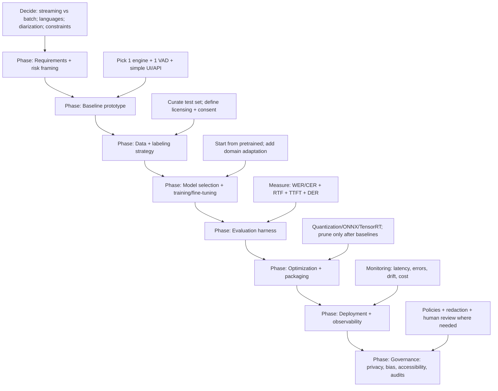

# Building Audio-to-Text Systems in 2026: A Technical Survey of ASR Architectures, Data, Tooling, Deployment, and Risks

## Executive summary

Automatic Speech Recognition (ASR) (Automatic Speech Recognition) systems have converged toward **end-to-end neural architectures** with **Transformer/Conformer-family encoders** and (in production streaming) **Transducer-style decoders** (Recurrent Neural Network Transducer (RNN-T) / Transformer-Transducer), while **batch/offline transcription** often favors **attention-based encoder–decoder (AED) (Attention-based Encoder–Decoder)** style models and/or multi-pass rescoring for maximum accuracy. citeturn0search4turn1search1turn1search7turn12search9

Training practices have similarly converged toward leveraging **scale** via (a) **self-supervised learning (SSL) (Self-Supervised Learning)** pretraining (e.g., wav2vec 2.0) and multilingual variants, plus (b) **semi-supervised self-training / pseudo-labeling** on unlabeled audio, which can dramatically reduce labeled-data needs while improving robustness—at the cost of additional pipeline complexity and careful quality control. citeturn0search1turn19search19turn21search3turn21search2

A production-grade audio-to-text system is rarely “just the acoustic model”: practical deployments typically include **voice activity detection (VAD) (Voice Activity Detection)** and endpointing, optional **speaker diarization** (Who spoke when), punctuation/casing restoration, confidence estimation, and operational controls (monitoring, privacy, redaction). These components can dominate user-perceived quality even when the core WER (Word Error Rate) is excellent. citeturn8search15turn17search1turn18search3turn7search1

**Assumption (explicit):** you provided no hard constraints on latency, target languages, compute budget, or regulatory environment; this report therefore surveys options across (i) low-latency streaming, (ii) high-accuracy batch, (iii) multilingual, and (iv) on-device/edge deployments, and calls out where decisions diverge sharply by constraint. citeturn11search1turn10search9turn11search6

## Problem scope and requirement decomposition

A useful way to scope ASR is to treat it as a bundle of coupled decisions: processing mode (streaming vs batch), language coverage, speaker complexity, domain conditions, output format, and acceptable error/latency trade-offs. Cloud products explicitly separate “real-time” vs “batch” transcription modes, and GPU service stacks often support both as well. citeturn11search1turn11search2turn10search9

### Streaming vs batch

**Streaming ASR** demands low end-to-end latency and stable partial hypotheses. This usually implies:  
- **Chunked or causal encoder computation** (limited right context / lookahead).  
- **Incremental decoding** (token-by-token emission) and careful endpointing (stop conditions).  
- Measuring latency with metrics beyond WER, such as **first token emission delay** and **user-perceived latency** (both discussed explicitly in on-device latency work). citeturn8search15turn22search20turn11search6

In contrast, **batch/offline ASR** is optimized for accuracy and throughput on long recordings; it can afford full-context attention, multi-pass rescoring, and richer post-processing (punctuation, diarization, alignment) because the user is not waiting for frame-synchronous outputs. Toolkits and services document this as “offline/batch” recognition receiving an audio buffer or file instead of a live stream. citeturn11search2turn11search9turn10search6

### Language coverage, multilinguality, and code-switching

Language coverage is more than “how many languages”: it includes **code-switching**, dialects, and domain vocabulary. Open datasets show the community trend toward multilingual scale: **Multilingual LibriSpeech (MLS) (Multilingual LibriSpeech)** covers eight languages with very large English hours, while **FLEURS (Few-shot Learning Evaluation of Universal Representations of Speech)** targets 102 languages to evaluate universal speech representations. citeturn6search3turn6search2

Multilingual systems often trade peak English accuracy for coverage and robustness; however, modern large-scale multilingual training can be competitive, especially when paired with domain adaptation or contextual biasing. citeturn0search6turn22search0turn20search6

### Speaker count, overlap, and diarization scope

If the audio may contain multiple speakers (calls, meetings, multi-party rooms), you need to decide whether you require:  
- **No diarization** (single transcript only).  
- **Speaker change markers** (A/B turns).  
- **Speaker-attributed transcript** with segments and timestamps.  

Speaker diarization is typically evaluated using **Diarization Error Rate (DER) (Diarization Error Rate)**, defined as a combination of false alarm, missed detection, and speaker confusion over time. citeturn17search1turn17search15

Some cloud services expose diarization directly (e.g., Amazon Transcribe documents diarization and a max speaker count; Google provides “detect different speakers” guidance). citeturn17search8turn17search5

### Domain mismatch and adaptation expectations

Domain mismatch (microphone, noise, speaking style, utterance length) is often a primary failure mode. A key empirical finding in the literature is that certain streaming end-to-end models can fail to generalize out-of-domain—e.g., short-segment training vs long-form decoding—unless trained/decoded with techniques designed for those mismatches. citeturn22search2turn22search18

In practice, “adaptation” usually decomposes into:  
- **Vocabulary/context injection** (phrase hints, biasing).  
- **Language model (LM) (Language Model)** adaptation or rescoring.  
- **Acoustic fine-tuning** on in-domain audio (when legal/available).  
Major cloud providers explicitly support “phrase lists” / “model adaptation” / “custom language models” as first-line domain adaptation mechanisms. citeturn22search0turn22search1turn22search4

### Reference architecture

```mermaid
flowchart LR
  A[Audio input: mic/file/telephony] --> B[Decode/Resample: PCM 16 kHz mono]
  B --> C[VAD (Voice Activity Detection) + endpointing]
  C -->|speech segments/frames| D[ASR model inference]
  D --> E{Mode}
  E -->|streaming| F[Partial + final tokens/events]
  E -->|batch| G[Full transcript + segments]
  F --> H[Post-process: normalization]
  G --> H
  H --> I[Punctuation + casing]
  H --> J[Word/segment timestamps + confidence]
  H --> K[Optional diarization/speaker attribution]
  I --> L[Downstream: NLU (Natural Language Understanding), search, summarization]
  J --> L
  K --> L
  L --> M[Storage + analytics + monitoring]
```

## Modeling choices and trade-offs

The architecture choice is primarily about: streaming latency requirements, available training data, domain mismatch, and deployment constraints (edge vs GPU cloud). Research and industry toolkits provide strong evidence for each model family’s strengths.

### Hybrid vs end-to-end: what still matters

**Hybrid systems** typically combine a learned acoustic model (historically Gaussian Mixture Model (GMM), later Deep Neural Network (DNN)) with a Hidden Markov Model (HMM) decoding graph, often implemented with **Weighted Finite-State Transducers (WFST) (Weighted Finite-State Transducers)**. The WFST framing unifies lexicon, acoustic, and language model constraints and is heavily used in classic toolkits. citeturn3search2turn3search3turn0search3

Hybrid advantages remain practical: interpretability, controllable lexicons/pronunciations, strong small-data and domain-control behavior, and mature decoding tooling. However, modern end-to-end systems often outperform hybrids on major benchmarks when trained at scale, and greatly reduce pipeline engineering. citeturn4search2turn0search4turn12search9

### End-to-end families: CTC, AED, Transducer

Key end-to-end objectives differ in alignment assumptions and streaming suitability:

- **CTC (Connectionist Temporal Classification)** learns alignments implicitly with a conditional independence assumption; it often benefits from an external language model and beam search decoding. citeturn1search0turn19search4  
- **AED (Attention-based Encoder–Decoder)** (e.g., Listen, Attend and Spell) models dependencies via an attention decoder; historically strong for batch but needs monotonic/streaming adaptations to be truly low-latency. citeturn12search0turn12search9  
- **Transducer / RNN-T (Recurrent Neural Network Transducer)** provides streaming-friendly sequence transduction with a prediction network and joint network; heavily favored in industry streaming deployments. citeturn1search1turn22search20

A comparative analysis from major industrial research explicitly frames **RNN-T as more prominent in industry due to streaming nature**, while AED attracts academic interest for attention power, highlighting the real-world bifurcation between streaming and offline optimization targets. citeturn12search9

### Encoder architectures: RNN, Transformer, Conformer, memory-efficient streaming

Encoder choice drives both accuracy and compute:

- **Transformer encoders** capture global interactions but naive self-attention is expensive and non-causal. citeturn1search3turn1search7  
- **Conformer (Convolution-augmented Transformer)** explicitly combines self-attention with convolution to model both global and local dependencies; it reported state-of-the-art results on LibriSpeech including strong WER with and without external language models, and competitive performance even with small (~10M parameter) variants. citeturn0search0turn0search4  
- **Emformer (Efficient Memory Transformer)** is explicitly designed for low-latency streaming by distilling history into memory and caching keys/values, reducing self-attention cost while supporting block processing. citeturn12search3

Transformer-Transducer designs explicitly allow latency–accuracy tradeoffs by varying right context during inference and even supporting dual “Y-model” modes (low-latency streaming output plus delayed higher-accuracy output). citeturn1search7

### Pretraining and foundation models

Two major “scaling paths” dominate modern ASR:

- **Self-supervised learning (SSL) pretraining + fine-tuning**, exemplified by wav2vec 2.0, which masks latent speech representations and learns via a contrastive objective, enabling strong WER even with very limited labeled data. citeturn0search1turn0search5  
- **Large-scale weakly supervised / multitask training**, exemplified by Whisper, trained on very large web-scale multilingual/multitask supervised data and positioned for robustness across accents/noise/technical language. citeturn10search3turn0search6turn10search0

For multilingual SSL specifically, XLS-R (cross-lingual wav2vec 2.0) is documented as pretrained on 128 languages and hundreds of thousands of hours of unlabeled speech, illustrating the strong community push toward multilingual representation learning at scale. citeturn19search19

### Model family comparison

| Model family | Streaming suitability | Accuracy ceiling (typical) | Key pros | Key cons | Maturity |
|---|---:|---:|---|---|---|
| Hybrid DNN-HMM + WFST (Weighted Finite-State Transducers) | Medium (can be real time) | High (domain-controlled) | Strong controllability (lexicon, LM), mature decoding toolchains, well-understood. | More pipeline engineering; end-to-end at scale can outperform on diverse conditions. | Very mature. |
| CTC (Connectionist Temporal Classification) | Good | High (with LM) | Simple objective; efficient decoding; works well with external LM rescoring. | Conditional independence; often needs LM for best results. | Very mature. |
| AED (Attention-based Encoder–Decoder) | Medium (needs streaming mods) | Very high (batch) | Strong sequence modeling; good for long-form with full context. | Streaming requires monotonic/delayed attention; can be less stable for partial hypotheses. | Very mature. |
| RNN-T / Transducer | Excellent | Very high (streaming) | Designed for streaming; industry-favored; strong latency control. | Training/decoding complexity; domain mismatch can be severe without care. | Very mature. |
| Transformer/Conformer encoder + Transducer | Excellent | Very high | Strong accuracy; good compute–accuracy tradeoffs; Conformer SOTA results reported. | Engineering complexity; attention cost requires optimizations for on-device. | Very mature and actively evolving. |
| Foundation-model transcription (large weakly supervised) | Medium (often batched; streaming wrappers exist) | Very high robustness | Strong cross-domain robustness; multilingual multitask. | Generative behaviors can yield “hallucinated” text in some settings; heavier compute. | Mature, fast-moving. |

Sources for this table: classic hybrid acoustic modeling and WFST surveys; CTC and Transducer foundations; Conformer results; industry comparisons; domain mismatch findings. citeturn3search2turn3search3turn1search0turn1search1turn0search4turn12search9turn22search2

## Data, training strategies, evaluation, and privacy-preserving learning

### Public corpora and benchmarks

A durable pattern in ASR research is: benchmarks shape what “good” looks like. The community commonly uses read-speech (LibriSpeech/MLS) for baseline modeling, conversational telephone speech (Switchboard/Hub5) for spontaneous speech, meeting corpora (AMI) for overlap/noisy far-field conditions, and robustness challenges (CHiME). citeturn4search0turn6search3turn5search19turn5search16turn5search2

| Dataset | What it’s good for | Scale / coverage (as documented) | Access / licensing notes | Typical pitfalls |
|---|---|---|---|---|
| LibriSpeech | Clean read English baselines; reproducible benchmarking | ~1000 hours read English; widely used benchmark | CC BY 4.0 noted in corpus paper; hosted via OpenSLR | Overestimates real-world performance; limited noise/channel diversity. |
| Common Voice | Multilingual ASR; low-resource experiments; speaker diversity | Massively-multilingual crowdsourced corpus | Public dataset; continuously evolving | Quality/consistency varies by language; domain mismatch to your target. |
| Multilingual LibriSpeech (MLS) | Multilingual read-speech; multilingual LM/AM training | 8 languages; very large English hours and substantial non-English hours | Distributed via OpenSLR links | Read speech ≠ conversational; accent/domain mismatch. |
| VoxPopuli | Large-scale multilingual unlabeled + labeled speech | Hundreds of thousands of hours unlabeled; ~thousands transcribed; 23 languages in project materials | Released via official repository | Parliamentary speech domain; may not transfer to casual conversation. |
| GigaSpeech | Large multi-domain English supervised training | 10,000 hours transcribed; additional audio for semi/unsupervised | Official dataset repository | Still English-centric; licensing/usage constraints must be checked carefully for product use. |
| Switchboard-1 | Conversational telephone ASR; classic benchmarks | ~260 hours telephone speech | LDC distribution (paid/restricted) | Telecom channel specific; licensing limits. |
| AMI Meeting Corpus | Multi-speaker meeting ASR + diarization | ~100 hours meetings (multi-modal) | Public corpus with access process | Far-field noise + overlap makes WER and DER difficult; requires diarization-aware evaluation. |
| CHiME (robust ASR challenges) | Far-field multi-mic robustness; noisy conversational scenarios | Multiple challenge datasets (e.g., CHiME-5 home “dinner party” scenario) | Challenge datasets, curated | Harder than typical product audio; not representative unless your domain matches. |
| VoxCeleb | Speaker identification/verification embeddings | Large-scale “in the wild” speaker dataset | Public dataset via publications | Licensing and demographic biases; not designed for verbatim ASR. |

Sources for this table. citeturn4search0turn4search1turn4search8turn6search3turn6search7turn6search9turn6search4turn5search19turn5search16turn5search2turn5search3

### Data augmentation and synthetic data

Augmentation is now “default”. **SpecAugment** (time/frequency masking and warping on spectrogram features) is a canonical, widely adopted method that reported state-of-the-art improvements on LibriSpeech and Switchboard tasks, and is often used as a standard knob to improve robustness without collecting new labeled data. citeturn4search2turn4search6

Beyond SpecAugment, production-grade pipelines routinely use noise mixing, reverberation simulation, speed perturbation, and codec simulation—especially for telephony. While many of these are engineering conventions, the robustness datasets and challenge settings (e.g., CHiME far-field) illustrate why augmentation targeting room/noise/channel effects is necessary for real deployments. citeturn5search2turn5search9

Synthetic data is increasingly used in targeted ways: multilingual and code-switching datasets have even included **generative Text-to-Speech (TTS) (Text-to-Speech)** components to broaden language-pair coverage, illustrating mainstream acceptance of “synthetic but controlled” additions when real recordings are scarce. citeturn6search10turn6search2

### Semi-supervised learning and self-training

Large unlabeled datasets (e.g., Libri-Light) were created specifically to benchmark limited-supervision ASR, documenting that “more unlabeled audio” can help pretraining, while gains can diminish with scale and depend on model quality. citeturn21search1turn21search9

A widely used approach is **self-training / pseudo-labeling**, where a strong teacher generates transcripts for unlabeled audio and the student retrains on those pseudo-labels. This was revisited explicitly for end-to-end ASR, showing meaningful improvements provided filtering and diversity mechanisms are used. citeturn21search3turn21search0

The “Noisy Student” family adapts this idea by adding augmentation/noise during student training; it has a dedicated ASR formulation and is widely cited as a pragmatic semi-supervised recipe. citeturn21search2turn21search6

### Privacy-preserving data and training

Speech data is often sensitive (identities, medical details, workplace info). Two “privacy-preserving” directions are prominent:

- **Federated Learning (FL) (Federated Learning)** for ASR, where devices train collaboratively without sending raw audio. Research explores federated representation learning and federated fine-tuning for ASR tasks. citeturn13search18turn13search6  
- **Differential Privacy (DP) (Differential Privacy)** and related methods (e.g., Private Aggregation of Teacher Ensembles (PATE)), which aim to reduce leakage but often degrade accuracy unless carefully designed; industry research posts discuss DP improvements for end-to-end speech recognition. citeturn13search22turn13search15

A critical nuance is that privacy is not “free”: attacks can infer speaker information from personalized acoustic models, especially relevant in federated settings. This implies privacy threat modeling must include model inversion / speaker leakage, not just raw-data exfiltration. citeturn13search3

### Evaluation metrics: accuracy, latency, robustness, and diarization

**WER (Word Error Rate)** is the dominant metric and is formally defined in evaluation plans as (substitutions + deletions + insertions) divided by reference word count. citeturn8search4turn8search12

For some languages/scripts, **CER (Character Error Rate)** is used analogously at the character level (common in Mandarin/Japanese contexts); this is an established practice though exact definitions mirror edit-distance concepts. citeturn8search0turn3search1

Latency and throughput are typically tracked with:  
- **RTF (Real-Time Factor)** (processing time / audio duration); RTF < 1 implies faster-than-real-time throughput. citeturn8search13turn8search1  
- **Time to First Token (TTFT)** (Time to First Token) / Time to First Byte (TTFB) (Time to First Byte) for streaming responsiveness, commonly discussed in voice-agent evaluations. citeturn8search7turn8search15  
- **DER (Diarization Error Rate)** when speaker diarization is required. citeturn17search1turn17search15

A recurring operational lesson is that user-perceived latency depends on endpointing and emission timing, not just raw model compute; on-device studies explicitly decompose these latency components. citeturn8search15turn22search20

## Tooling ecosystem and implementation options

This section focuses on *practical implementation substrates*: open-source toolkits (trainable stacks), optimized inference projects (deployment stacks), and managed APIs (outsourced ASR).

### ASR engines and toolkits comparison

| Engine / service | What it is | Streaming support | Customization options | Deployment profile | Maturity / notes |
|---|---|---:|---|---|---|
| Kaldi | Research/production toolkit centered on WFST decoding graphs | Yes (with online decoding recipes) | Strong (lexicon + LM + acoustic recipes) | CPU/GPU; self-hosted | Extremely mature; foundational in ecosystem. |
| ESPnet | End-to-end speech toolkit with recipes; follows Kaldi-style data prep | Yes (models vary; supports E2E recipes) | High (train your own, many recipes) | Python/PyTorch training; self-hosted | Mature and widely used in research. |
| NVIDIA NeMo | Speech AI framework with pretrained ASR models + training | Yes (streaming architectures supported) | High (fine-tune/train; model zoo) | GPU-centric; integrates with NVIDIA stack | Mature; strong production orientation. |
| SpeechBrain | General-purpose speech toolkit with recipes/models | Possible (tutorials exist for streaming Conformer) | High | Python/PyTorch; self-hosted | Mature; strong academic/community traction. |
| Vosk | Offline speech recognition toolkit (Kaldi-based) | Yes (partial/final results APIs) | Moderate (swap models; limited training workflow) | Edge-friendly; supports lightweight devices | Mature for embedded/offline use; simpler than training toolkits. |
| Whisper (open-source) | Multilingual multitask model released with code | Not designed for streaming by default; wrappers exist | Low-to-moderate (fine-tuning exists but not core focus) | CPU/GPU; many optimized ports | Highly popular; strong robustness claims. |
| whisper.cpp | C/C++ inference port enabling on-device Whisper with quantized models | “Naive” real-time demo + streaming patterns | Limited (inference-focused) | Edge/desktop/mobile CPU; some GPU | Very pragmatic for on-device deployments. |
| faster-whisper (CTranslate2) | Optimized Whisper inference via CTranslate2 | Primarily batch; can be used in streaming wrappers | Inference-focused; quantization options | CPU/GPU; efficient batching | Reports up to ~4× speedups and 8-bit quantization support. |
| OpenAI Speech-to-Text API | Managed transcription API + real-time transcription mode | Yes (Realtime transcription) | Output formats include diarized_json; model selection | Cloud API | Fast iteration; vendor dependence. |
| Google Cloud Speech-to-Text | Managed ASR API | Yes (streaming) | Model adaptation / phrase biasing; diarization feature | Cloud API | Mature enterprise product. |
| Amazon Transcribe | Managed ASR API for files + streams | Yes (files + streaming) | Custom vocabulary + custom language models; diarization | Cloud API | Mature enterprise product with diarization/formatting features. |
| Azure Speech-to-text | Managed ASR API | Yes (real-time + batch) | Phrase list; custom speech training | Cloud API | Mature; strong documentation on WER/RTF evaluation. |
| NVIDIA Riva | GPU-accelerated speech microservices (ASR/TTS/etc.) | Yes (streaming + offline) | Customization across ASR pipeline | Self-hosted GPU microservice stack | Production-grade low-latency GPU stack. |

Sources for this table. citeturn0search3turn2search0turn2search1turn19search3turn2search6turn10search0turn9search3turn20search0turn11search6turn11search7turn10search9turn22search0turn10search6turn22search8turn11search1turn22search1turn11search2

### Supporting components: audio I/O, VAD, diarization, punctuation, speaker ID

Even the best ASR model will fail if upstream segmentation is wrong or downstream formatting is weak.

**VAD (Voice Activity Detection)** (Voice Activity Detection) is commonly implemented with WebRTC VAD bindings (fast classical approach) or neural VAD like Silero VAD (optimized, claims sub-millisecond chunk processing). citeturn7search1turn7search2

**Speaker diarization** is commonly built with pyannote.audio pipelines (open-source, pretrained diarization tooling) and evaluated via DER; pyannote.audio has a dedicated toolkit paper and a diarization pipeline overhaul in version 2.1. citeturn7search8turn7search4turn17search15

**Speaker embeddings / speaker identification** often relies on x-vectors (Robust DNN embeddings) as a foundational technique, with strong evidence of robustness improvements via augmentation. citeturn7search3

**Punctuation restoration** is often treated as a transformer-based token classification task; there are both research papers and widely used open-source implementations, with explicit warnings that training domain (e.g., political speeches) can affect performance. citeturn18search3turn18search2turn18search4

## Deployment, optimization, and operations

### Edge vs cloud: decision drivers

**Cloud deployment** is typically chosen when you need rapid scaling, multi-language support, and managed updates; but it introduces vendor lock-in, latency variability, and data governance complexity. Cloud products emphasize streaming transcription and feature add-ons like diarization and adaptation, but you must assess privacy/legal compliance for your domain. citeturn10search9turn17search8turn11search1turn14search3

**Edge/on-device deployment** is chosen when you need (a) low-latency under poor connectivity, (b) cost control at scale, or (c) stronger privacy (audio never leaves device). On-device research explicitly examines power usage and RTF tradeoffs for streaming models and shows that accuracy–power–latency trade-offs must be measured empirically on target hardware. citeturn12search15turn8search13turn8search15

### Optimization techniques: quantization, ONNX, TensorRT, pruning

**Quantization** (reducing numeric precision) is a standard lever to cut memory and speed inference. ONNX Runtime documents 8-bit linear quantization workflows, while TensorRT documents supported quantized types (INT8, INT4 weight-only quantization, FP8 variants) and how quantization is represented. citeturn9search0turn9search1

For Whisper-family inference specifically, faster-whisper claims up to ~4× speed improvements compared to the reference implementation and highlights 8-bit quantization on CPU/GPU for additional efficiency, while whisper.cpp explicitly provides a real-time audio input example (though “naive”). citeturn20search0turn9search3

**TensorRT workflows** commonly ingest models via ONNX parsers and then apply inference-time optimizations; NVIDIA documentation positions ONNX export as a common path into TensorRT. citeturn9search5turn24search17

**Pruning** (removing parameters/structures) is supported in mainstream ML frameworks (PyTorch provides structured/unstructured pruning utilities) and vendor optimizers increasingly package pruning + distillation as a workflow. NeMo documentation explicitly recommends pruning followed by knowledge distillation to preserve accuracy. citeturn24search0turn24search4turn24search9

A practical caution: pruning/quantization can shift error profiles (e.g., rare words, accented speech) even if aggregate WER looks acceptable; this matters for fairness/regulatory audits. Research on fairness-aware structured pruning underscores that compression can interact with fairness metrics, not just accuracy. citeturn24search10turn13search0

### Operational concerns: stability, confidence, and timestamping

Production ASR almost always needs:  
- **Confidence estimation** (for UI cues, human review routing, or safety constraints).  
- **Timestamps / alignment** (for captions, search indexing, diarization fusion).  
- **Robust endpointing** (stop too early vs too late).  

Industry research discusses practical challenges for deploying RNN-T systems including adaptation without collecting audio, and obtaining time stamps and confidence. citeturn22search18turn8search15

## Security, privacy, legal, bias, and accessibility

### Security threats unique to speech interfaces

Speech systems are exposed to *audio-domain adversaries*:

- **Hidden voice commands** can embed commands that humans perceive as noise but devices interpret as valid commands. citeturn15search0turn15search8  
- **Ultrasonic command injection** (DolphinAttack) can modulate commands on ultrasonic carriers using microphone nonlinearities to produce inaudible yet effective attacks. citeturn15search1turn15search9  
- **Targeted adversarial examples** have been demonstrated against end-to-end speech-to-text systems (including attacks on DeepSpeech-style models), showing the feasibility of optimizing audio perturbations that transcribe to attacker-chosen phrases. citeturn15search2turn15search6  

Mitigations typically combine hardware filtering, model-side defenses, and application-layer constraints (e.g., limiting high-privilege actions), but there is no single “silver bullet” documented across deployments. citeturn15search0turn15search1

### Privacy and legal compliance

Voice data frequently qualifies as **personal data**; and when voice is processed to uniquely identify a person (speaker authentication / speaker biometrics), it may fall into **biometric data** definitions under privacy law. The GDPR definition of biometric data explicitly covers processing of physical/behavioral characteristics enabling unique identification. citeturn23search7turn14search1

For “virtual voice assistants,” the **European Data Protection Board (EDPB)** provides detailed guidance including reminders about Article 9 GDPR constraints for special categories of data when applicable. citeturn14search3turn23search2

Regulatory context is also evolving beyond GDPR: the **European Union (EU)** has adopted an AI Act risk-based framework (high-level official summaries exist), which can become relevant when speech systems are used in high-risk contexts (employment, healthcare, biometrics) or when voice is used for biometric identification/categorization. citeturn23search0turn23search8

### Bias and representational harms

Empirical audits show significant disparities: a prominent study (“Racial disparities in automated speech recognition”) found substantial WER gaps between Black and White speakers across multiple systems, attributing disparities largely to underlying acoustic models. citeturn13search0

More recent evaluations also emphasize bias in domain settings like healthcare and for disfluent speech (e.g., stuttering), showing that accuracy disparities can persist in real-world deployments and can be amplified downstream (medical documentation, access services). citeturn16search22turn16search3

### Accessibility requirements for captions

Accessibility standards and regulators emphasize that captions must be accurate and complete. The W3C guidance explicitly warns that auto-generated captions are usually insufficient unless confirmed fully accurate; and WCAG Success Criterion 1.2.2 requires captions for prerecorded synchronized media. citeturn16search2turn16search0

The **Federal Communications Commission (FCC)** in the United States discusses caption quality dimensions such as accuracy, timeliness, and placement in its guidance on closed captioning quality. citeturn16search1turn16search5

**Implication:** if your ASR output is used as accessibility captions, you likely need a human-in-the-loop editing workflow or exceptionally high-confidence controls (and a documented quality process), rather than assuming “ASR = captions.” citeturn16search2turn16search1

## Recommendations, open research gaps, and an implementation roadmap

### Converging “community answers” vs open gaps

**Converging answers (high confidence):**
- **Conformer-family encoders** are a strong default for accuracy/robustness, with published benchmark-leading results and good small-model behavior. citeturn0search4turn0search0  
- **Transducer (RNN-T/Transformer-Transducer)** is the practical default for *low-latency streaming*, with a large body of work on streaming constraints, latency control, and deployment challenges. citeturn1search1turn1search7turn22search18  
- **SSL pretraining + fine-tuning** is the default for low-resource and domain adaptation when labeled data is scarce. citeturn0search1turn19search19  
- **VAD + endpointing + post-processing** often determines user-perceived quality as much as the core WER. citeturn8search15turn7search10turn18search3  

**Open research/engineering gaps (still active):**
- **Reliable streaming endpointing** under overlap/noise and conversational turn-taking remains a major quality driver; recent work continues to target token emission delay and endpoint behavior. citeturn8search3turn22search20turn8search15  
- **Long-form robustness and domain mismatch** remains non-trivial for end-to-end streaming models; published analyses show extreme degradations and the need for special training/decoding strategies. citeturn22search2  
- **Hallucinated text / confabulations** in large generative transcription models is a real operational risk, particularly for high-stakes domains; investigative reporting highlights this problem for Whisper-based medical transcription deployments. citeturn10news36turn10news32  
- **Fairness across dialects, accents, and speech disabilities** remains an empirical and dataset coverage problem; multiple studies document substantial disparities. citeturn13search0turn16search3turn16search22  
- **Privacy-preserving learning with strong utility** (federated + differential privacy) remains difficult; attacks on adapted acoustic models show privacy leakage risks even when raw audio is not shared. citeturn13search18turn13search3turn13search22  

### Concrete stack recommendations by use case

The recommendations below are “reference stacks” aligned with typical constraints; each includes a core ASR approach plus supporting components.

#### Low-latency streaming transcription (interactive UI, voice agents, call captioning)

**Best-fit architecture:** Conformer/Emformer encoder + Transducer decoder (RNN-T / Transformer-Transducer), with explicit latency tuning (chunk size/right context) and robust endpointing. citeturn12search3turn1search7turn12search15

**Pragmatic tooling options:**
- Use **NVIDIA Riva** for GPU-accelerated streaming ASR microservices where you can self-host on GPUs and want production-style deployment knobs. citeturn11search2turn11search11  
- Use **NeMo** if you want to train/fine-tune streaming-capable models (including Parakeet family options) and then deploy in an NVIDIA-oriented stack. citeturn20search10turn2search9  
- If your constraints are “works offline on CPU” and you can accept lower accuracy vs large models, consider **Vosk** plus strong VAD/endpointing and domain adaptation via custom vocabulary (where possible). citeturn2search6turn19search13turn7search1  
- If you prefer managed services, **OpenAI Realtime transcription**, **Google streaming**, **AWS Transcribe streaming**, or **Azure real-time speech-to-text** are direct options; select based on language support, diarization needs, and compliance posture. citeturn11search6turn10search9turn10search6turn11search1  

#### High-accuracy batch transcription (meetings, podcasts, legal discovery, media indexing)

**Best-fit architecture:** full-context encoder–decoder / foundation model transcription, optionally with second-pass rescoring and rich post-processing (diarization + punctuation + alignment). citeturn0search6turn7search4turn18search3

**Pragmatic tooling options:**
- **Whisper** for robust multilingual batch transcription (very strong adoption and tooling ecosystem). citeturn10search0turn0search6turn10search3  
- **faster-whisper** when you need higher throughput (batching, quantization) and are comfortable with an inference-optimized reimplementation. citeturn20search0turn20search8  
- Pair with **pyannote.audio** diarization when speaker attribution is required; evaluate with DER and validate overlap handling on your target audio. citeturn7search4turn17search15  

**Caution for high-stakes domains:** large generative transcription models can produce fabricated text; if errors are critical (medical/legal), use conservative thresholds, strong QA workflows, and consider constrained decoding pipelines. citeturn10news36turn10news32

#### Multilingual (broad language coverage, low-resource languages)

**Best-fit architecture:** multilingual SSL (e.g., XLS-R) or large multilingual supervised models, then language- and domain-specific fine-tuning if allowed. citeturn19search19turn6search2turn6search3

**Pragmatic tooling options:**
- Hugging Face wav2vec 2.0 ecosystem for fine-tuning Wav2Vec2ForCTC in many languages, with standard tooling for training/inference. citeturn19search1turn19search4  
- Whisper for “works out of the box” multilingual transcription and translation. citeturn10search0turn10search3  
- Evaluate using datasets like FLEURS for cross-language benchmarking and to avoid overfitting to English-only metrics. citeturn6search2  

#### On-device / edge (privacy-first, intermittent connectivity, cost control)

**Best-fit architecture:** compact or quantized models with on-device VAD, careful streaming buffers, and hardware-specific benchmarking (RTF and power). citeturn12search15turn8search13turn9search0

**Pragmatic tooling options:**
- **whisper.cpp** for on-device Whisper inference with quantized models and real-time demo code. citeturn9search3turn10search0  
- **Vosk** for embedded/offline ASR on lightweight devices (Raspberry Pi/mobile). citeturn2search6  
- Consider ONNX Runtime quantization and TensorRT acceleration when you have compatible hardware pipelines. citeturn9search0turn9search5turn9search1  

### Prioritized implementation roadmap



Roadmap justification and phase priorities are grounded in the fact that latency metrics (first token delay/user latency) and evaluation definitions (WER/RTF/DER) must be designed before optimization, and that domain mismatch/adaptation is a known primary failure mode. citeturn8search15turn8search4turn17search15turn22search2turn9search0

### Checklist of “missing pieces” teams commonly overlook

- **Golden evaluation set**: a frozen, representative dataset covering accents, noise, device channels, and domain vocabulary; without this, you will overfit to easy benchmarks like read speech. citeturn5search2turn13search0  
- **Latency instrumentation**: TTFT (Time to First Token) (Time to First Token), endpoint latency, and RTF (Real-Time Factor) measurement baked into the pipeline (not inferred ad hoc). citeturn8search7turn8search13turn8search15  
- **Segmentation correctness**: VAD tuning and “barge-in / overlap” handling; poor segmentation can dwarf model gains. citeturn7search10turn5search2turn8search15  
- **Confidence + abstention policy**: what happens when the model is uncertain or audio is non-speech; this is central to preventing fabricated text in sensitive settings. citeturn10news36turn22search18turn11search7  
- **Diarization requirements**: decide early whether you need speaker attribution; DER evaluation and overlap policy must be specified. citeturn17search1turn17search15  
- **Punctuation/casing**: readability and downstream NLP quality usually require repunctuation; choose a model trained on similar domain text. citeturn18search3turn18search2  
- **Privacy/legal**: document lawful basis, retention, redaction, and whether voice is used biometrically; follow EDPB guidance for voice assistants where applicable. citeturn14search3turn23search7  
- **Bias/accessibility audits**: test across demographic and disability-related speech variation; auto-captions may not meet accessibility requirements without verification/editing. citeturn13search0turn16search3turn16search2turn16search0  
- **Security threat model**: account for voice-command injection, ultrasonic attacks, adversarial audio, and access control around “actionable” transcripts. citeturn15search0turn15search1turn15search2  

